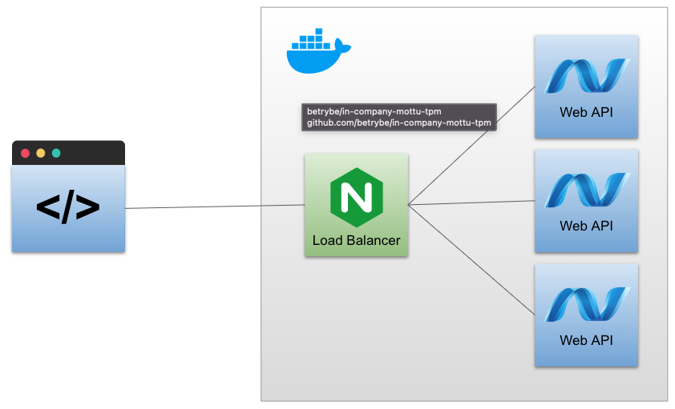
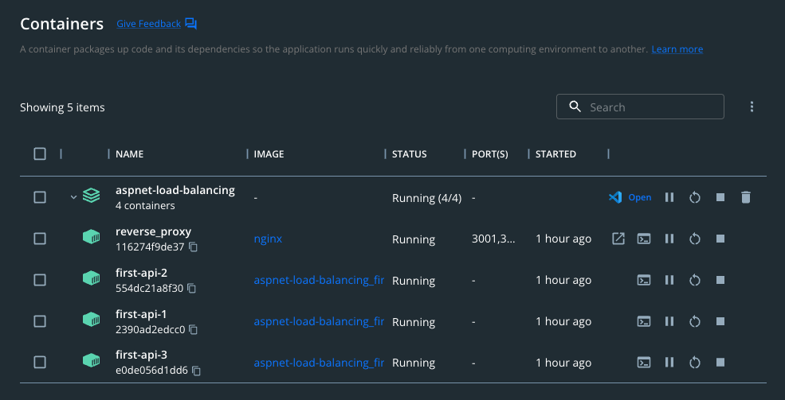
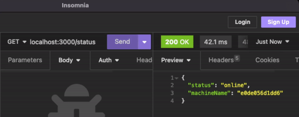


# ASP.NET Core - Load balancing with Nginx and Docker

This project aims to exemplify the scaling of a Web API built on ASP.NET Core with the increase in the number of instances and how to control load balancing using Nginx.


## Author

- [Rahiyan Safin](https://www.github.com/rahiyansafz)

[](https://www.linkedin.com/in/rahiyansafin/)
[](https://twitter.com/rahiyan_safin)
[](mailto:rahiaynsafin@gmail.com)

## Running the Project

Clone the repository

```shell
git clone git@github.com:rahiyansafz/netcore-load-balancing.git
```

Go to the directory

```shell
cd netcore-load-balancing
```

Upload the containers

```shell
docker compose up -d --build
```

## Demonstration

The architecture of this application can be seen below. We will have a request for the load balancer, managed by Nginx. It will send requests in order to all replicas of the ToDo API.



After uploading the docker compose, it will create 04 containers, 03 of which are the replicas of the Web API and one for nginx.



You will be able to see that each request is made to one of the containers.



## Reference

- [HTTP Load Balancing](https://docs.nginx.com/nginx/admin-guide/load-balancer/http-load-balancer/)
- [Host ASP.NET Core on Linux with Nginx](https://learn.microsoft.com/en-us/aspnet/core/host-and-deploy/linux-nginx?view=aspnetcore-8.0&tabs=linux-ubuntu)


